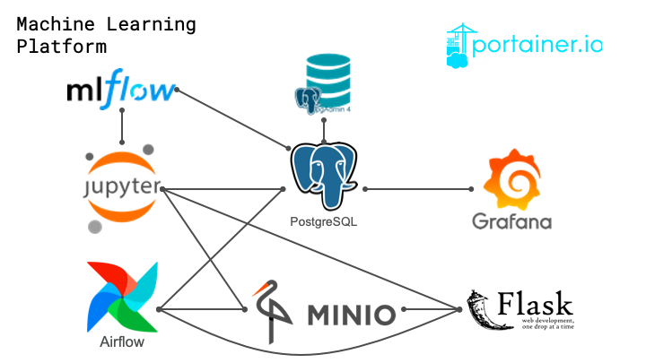

# Data Science Stack - Cookiecutter
Cookiecutter to launch an awesome Data Science toolstack in Docker.

# See it in action

# Overall Architecture
## Stack architecture

## Fucntional architecture

# Used Variables
The following table provides an overview about parameters, that are queried by cookiecutter (and why)

| Name | Description | Injected in Services |
| --- | --- | --- | 
| **project_name** | *Name of your project* | - |
| **jupyter_password** | *Password to protect your Jupyter service* | Jupyter |
| **postgres_db_password** | *Password of standard postgres user* | Postgres |
| **shared_db_password** | *Password for shared database* | Airflow Jupyter Postgres |
| **grafana_db_password** | *Password for grafana database* | Postgres Grafana |
| **grafana_admin_password** | *Password for grafana admin user* | Grafana |
| **minio_access_key** | *Access key for Minio store* | Airflow FlaskAPI Jupyter Minio |
| **minio_secret_key** | *Secret key for Minio store* | Airflow FlaskAPI Jupyter Minio |
| **pgadmin_default_email** | *Default user email for PgAdmin4* | Postgres |
| **pgadmin_default_password** | *Default password for PgAdmin4* | Postgres |
